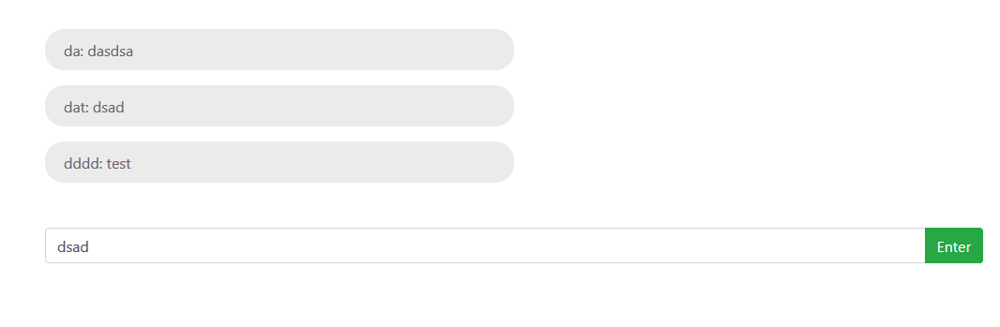

#  Real-time Chat Application

## Introduction



This is an application that allows users to join a common chat room, post and receive messages. The front-end is written in ReactJS, server is written in NodeJS with real-time features from Socket.IO. Database used is MongoDB (hosted by mLab). A running version could be accessed [here](https://datngo-chat-app.herokuapp.com/).

## Installation and Local Development

Clone this project from Github

```sh
git clone https://github.com/DatNgo1995/ChatApp.git
```

Go to the local directory and install with the following commands.
For server side:

```sh
cd ChatApp
npm install
npm start
```

For client side:
```sh
cd chat-app
npm install
npm start
```

Client runs at localhost:3000.

The application uses mLab for MongoDB database due to the limitation of a free Heroku account. However, ideally, for local deployment, local MongoDB can be used. 
To setup MongoDB, create new database. In a new terminal, start MongoDB by typing
```sh
mongod
```
By default, MongoDB server starts at port `27017`.
Assuming the database name is `chat-app`, in file `dbConnect.js`, at line 3, change the value of variable `mongodbUri` to:
 ```sh
mongodb://localhost:27017/chat-app
```